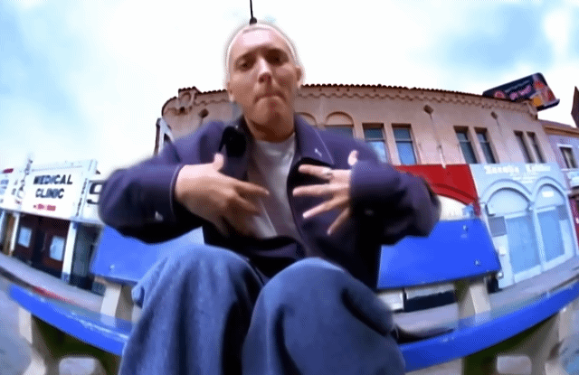
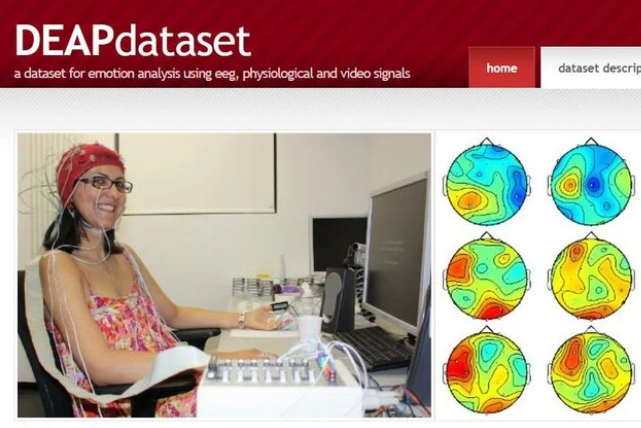
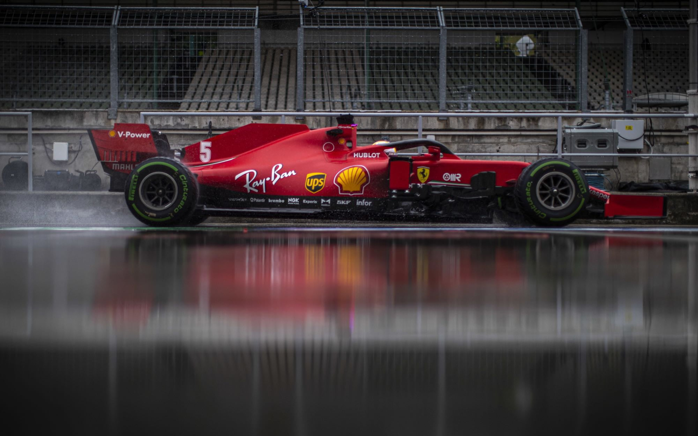
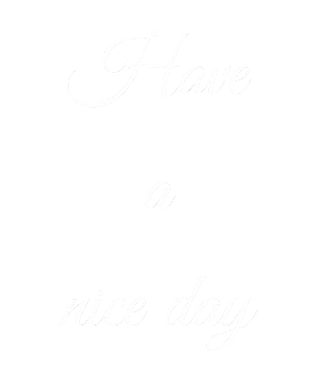

<!--
Credits and references used in this README:

1) Layout ideas and section inspiration:
   https://github.com/abhisheknaiidu/awesome-github-profile-readme?tab=readme-ov-file#descriptive-

2) Skill icons (SVG badges):
   https://github.com/tandpfun/skill-icons?tab=readme-ov-file#icons-list

3) GitHub stats card:
   https://github.com/anuraghazra/github-readme-stats
-->

<h1 align="center"> 😎 Welcome to Chabachib's Github 😊 </h1>

## My name is ...
<table>
  <tr>
    <td width="250">
      
    </td>
    <td valign="middle">
      

        <b>Nouh Taha CHEBCHOUB</b>  
      

      

        AI Engineer & Data Scientist specializing in end-to-end 
        machine learning systems, from data engineering to model deployment,
        with a focus on scalability and performance.
      

    </td>
  </tr>
</table>

## Skill stack

**Also comfortable with**: whatever the Project/Job requires, always open to learn new things and fast 😎

---

## Projects - showcase

<table width="100%">
  <tr>
    <td align="center" width="50%" valign="top">
      
       
      <b>EEG based Emotion Detection   from DEAP Dataset</b>
       
      <a href="https://github.com/Chabachib/EEG-Based-Emotion-Detection">Check the Repository</a>
    </td>
    <td align="center" width="50%" valign="top">
      
      <b>GAN-Based FPS Agent for   Human-like Aimbot</b>
       
      🔗 <a href="#">Check the Repository</a>
    </td>
  </tr>
  <tr>
    <td align="center" width="50%" valign="top">
      
      <b>Carla based Digital Twin for   an Electrical Vehicle</b>
       
      🔗 <a href="#">Check the Repository</a>
    </td>
    <td align="center" width="50%" valign="top">
      
      <b>Formula 1 Races   Analysis (under dev)</b>
       
      🔗 <a href="#">Check the Repository</a>
    </td>
  </tr>
</table>

## Contact me 

<table width="100%">
  <tr>
    <td width="70%" align="center">
      
    </td>
    <!-- Text column -->
    <td width="30%" valign="middle" align="center">
      
    </td>
  </tr>
</table>
